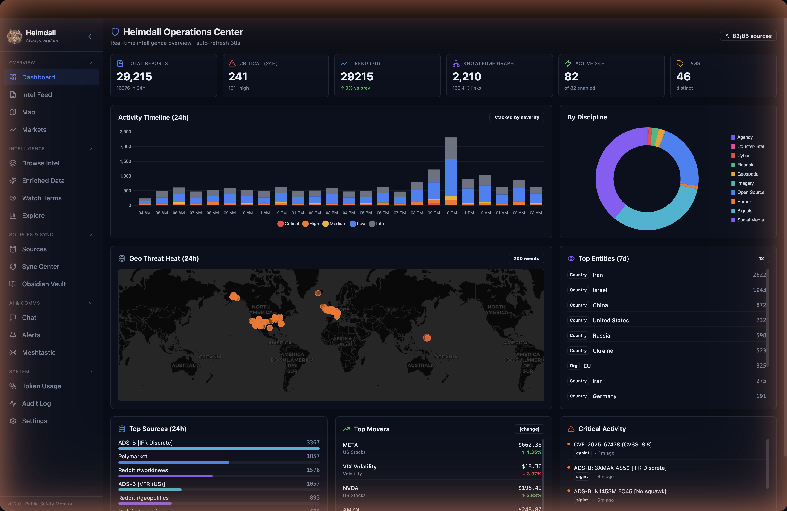
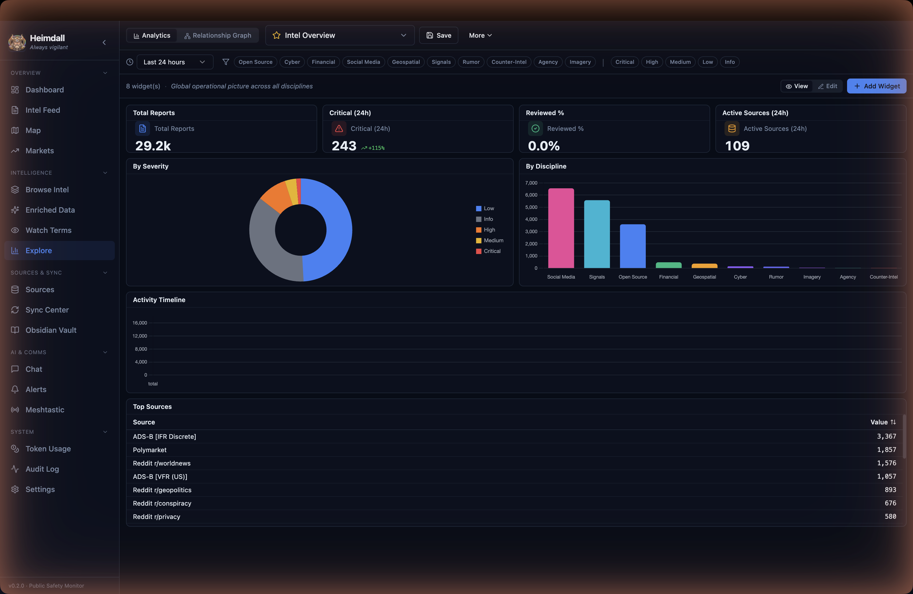
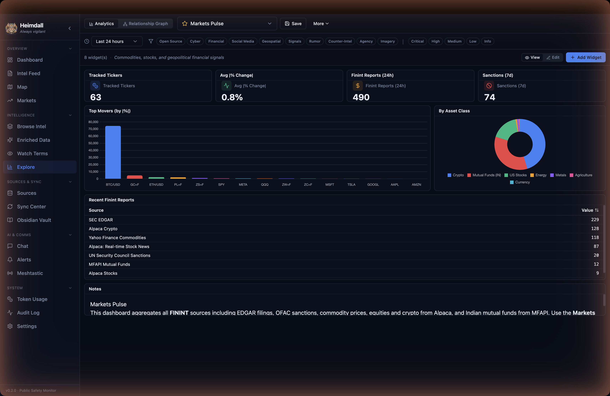
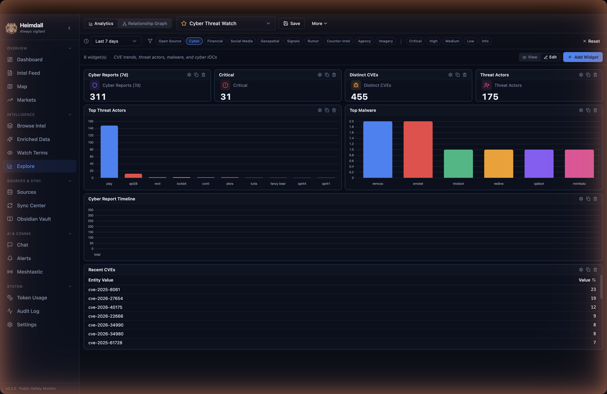
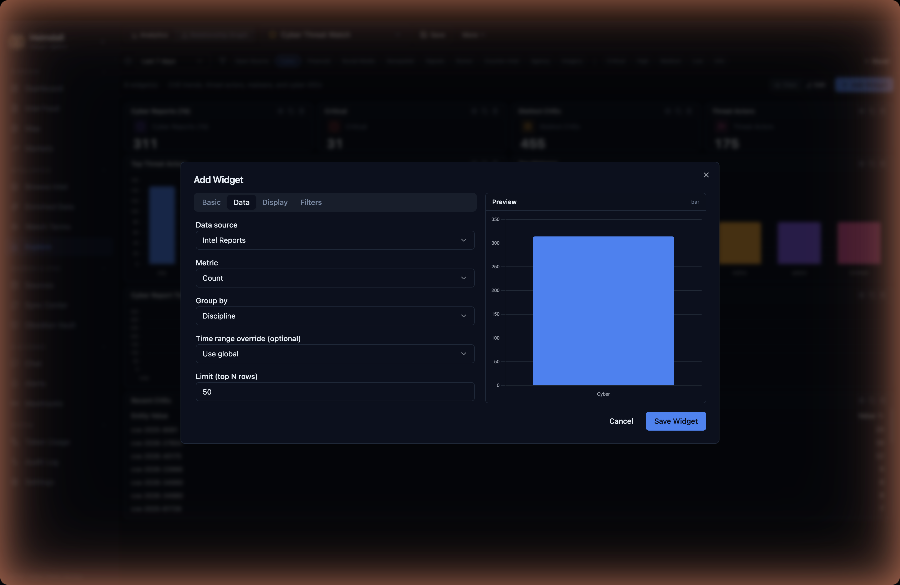
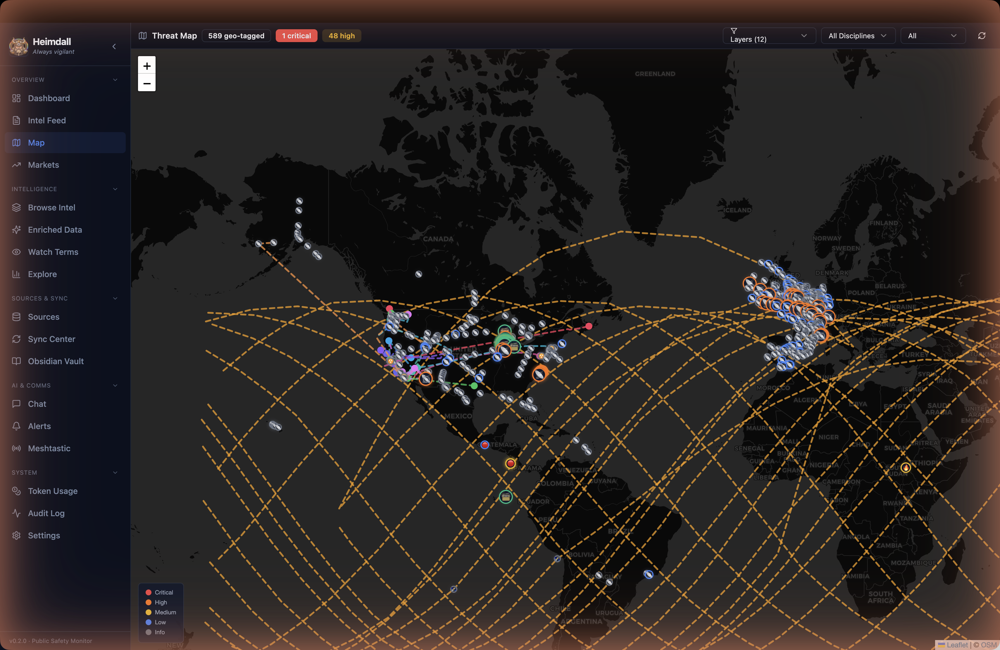
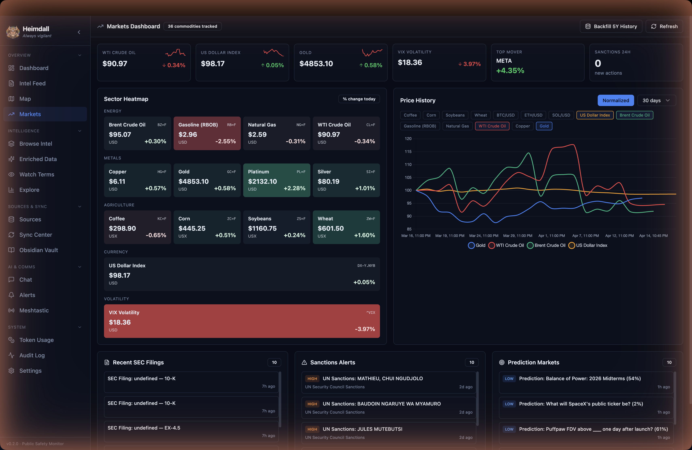
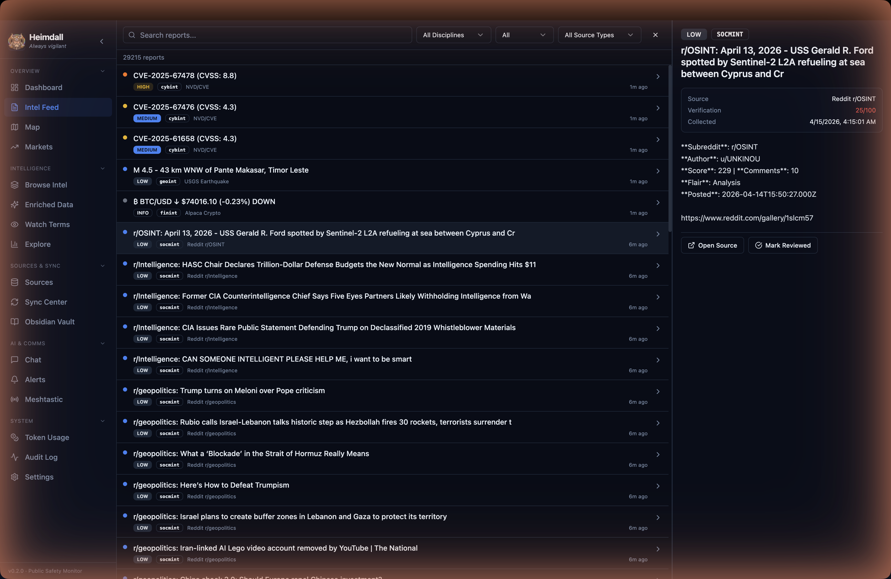

<p align="center">
  
</p>

<h1 align="center">Heimdall</h1>
<p align="center"><em>Always vigilant</em></p>

<p align="center">
  <a href="https://github.com/ankurCES/Heimdall/releases"></a>
  <a href="https://github.com/ankurCES/Heimdall/blob/main/LICENSE"></a>
  
  
  
</p>

---

**Heimdall** is a desktop intelligence monitoring platform for public safety. It aggregates open-source intelligence across 10+ disciplines, enriches data with AI, and presents a unified operational picture through geospatial mapping, relationship graphs, real-time alerting, and a full analytical workspace (ACH, KAC, red-team critique, estimative-probability calibration, chronologies, comparative analysis).

Built with Electron + React + TypeScript. Runs entirely on your machine — no cloud, no subscriptions.

---

## Screenshots

The app includes 55 pages organized into 6 sidebar groups: **Overview** (Dashboard, Workspace, Intel Feed, Map, Geofences, Markets), **Intelligence** (Browse Intel, Enriched Data, Watch Terms, I&W, ACH, Network, Entities, Counter-intel, CYBINT, Dark Web, Overnight, Anomalies, Images, Transcripts, Explore), **Sources & Sync** (Sources, Sync Center, Obsidian Vault, STIX Interop), **AI & Comms** (Chat, Workflows, Memory, Alerts, Meshtastic, Telegram Intel), **Library & Cases** (Reports Library, Daily Briefings, Entity Watchlist, Graph Canvas, Comparative Analysis, Hypothesis Tracker, Chronologies, Red-Team Critiques, Assumptions/KAC, Estimates/WEP, Case Files, Indicators, Source Reliability, Revision Inbox, Ethics Console, Memory Graph), **System** (System Health, Forecast Accountability, Token Usage, Audit Log, Quarantine, Advanced, Settings).

### Operations Center (Dashboard)

SOC-style overview with 6 KPI cards, 24h activity timeline stacked by severity, discipline doughnut, geo threat heatmap, top entities/sources/movers, and a critical activity feed — auto-refreshing every 30 seconds.



### Custom Analytics Reports (Explore) — Power BI-style

Customizable analytics dashboards with saved reports, drag/drop grid canvas, 8 widget types (KPI, bar, line, pie, doughnut, timeline, heatmap, table, markdown), and 3 built-in presets. Global slicers apply to all widgets; each widget can override or ignore them.

**Intel Overview preset** — KPIs + severity/discipline breakdowns + activity timeline + top sources:



**Cyber Threat Watch preset** — top threat actors, malware families, recent CVEs (pre-filtered to cybint discipline):


**Markets Pulse preset** — tracked tickers, top movers, asset-class mix, recent finint reports:



**Edit mode** — drag, resize, remove widgets; every widget gets hover chrome for settings / duplicate / delete:



**Widget Editor with live preview** — configure data source, metric, grouping, filters, and display options in a tabbed dialog. Preview renders on the right as you type.



### Geospatial Threat Map

Dark-themed Leaflet map with severity-colored markers, ADS-B / ISS trajectory paths as dotted great-circle interpolations, and discipline layer toggles.



### Markets Dashboard

Trader-style dashboard: VIX / USD / gold / oil KPIs, 14-commodity sector heatmap, multi-asset normalized price chart across 24h → 5y ranges, SEC filings, sanctions alerts, and Polymarket geopolitical contracts.



### Intel Feed

Virtualized list of every collected intel report with discipline / severity / source-type filters, sortable by time, verification score shown in detail pane.



---

## Features

### Analytical Workspace (Phase 10 — v2.0.0)

The analyst-facing layer on top of ingest + enrichment. Every artifact is a first-class persisted object you can drill into, link, stress-test, and version. Every surface speaks to every other.

| Surface | Route | What it does |
|---|---|---|
| **Workspace Home** | `/workspace` | One-glance morning view — 6-stat strip + 6 cards across hypotheses, critiques, vulnerable assumptions, due-soon estimates, comparisons, chronologies. Quick-create buttons. |
| **Comparative Analysis** | `/comparisons` | LLM-generated structured comparisons of two entities or two time windows. BLUF + shared themes + divergences + trajectory + open questions. |
| **Hypothesis Tracker** | `/hypotheses` | Operationalised Analysis of Competing Hypotheses (ACH). Every 15 min an auto-evaluator scores incoming intel against active hypotheses (`supports` / `refutes` / `neutral` / `undetermined` with confidence). Analyst can override any verdict; running tally honours overrides. |
| **Chronology Builder** | `/chronologies` | Curate timelines from raw events — analyst hand-picks events, annotates, reorders. Cross-surface "Add to chronology" button on entity timelines. Markdown export. |
| **Red-Team Critiques** | `/critiques` | LLM argues against your own analysis. Structured rebuttal: BLUF / Weak Assumptions / Alternative Explanations / Cognitive Biases / Missing Evidence / Sharpest Counter-Question. Runs against any hypothesis, comparison, chronology, briefing, or free-form topic. |
| **Key Assumptions Check** | `/assumptions` | List the assumptions an analysis depends on; grade each as well-supported / supported with caveats / unsupported / vulnerable. LLM extraction extracts candidates from any parent artifact. |
| **Estimative Probability Tracker** | `/estimates` | Log forecasts with ICD-203 Words of Estimative Probability ("almost certain" → "almost no chance"), deadline, resolution criteria. On resolution computes a Brier-style calibration score with per-WEP bucket comparison (your "likely" forecasts vs reality). |

**Cross-linking flow.** From any analytical surface you can spawn a critique or KAC against the current artifact. Each spawn is a single-click; the spawned object remembers its parent and shows a back-jump. This makes it trivial to walk the canonical IC tradecraft pipeline:

> Hypothesis → Run KAC → Extract assumptions via LLM → Grade them → Run red-team critique → Log key estimates → Resolve estimates over time → Watch calibration evolve in Workspace.

**First-launch tour.** A What's New modal fires once when the app detects a fresh major version, walking the analyst through every surface with one-click jump-to-page. Self-gates on `localStorage`.

### Intelligence Collection (58+ Sources)

| Discipline | Sources | Examples |
|-----------|---------|----------|
| **OSINT** | 13 | RSS feeds (BBC, NYT, Al Jazeera), GDELT, GNews, Factbook, Public Records, arXiv, Polymarket predictions |
| **CYBINT** | 8 | NVD CVEs, abuse.ch (URLhaus, Feodo Tracker), SANS ISC, Ransomware.live, C2IntelFeeds, Internet outage detection (IODA) |
| **FININT** | 6 | SEC EDGAR filings, OFAC sanctions, Yahoo Finance commodities (14 futures), MFAPI Indian mutual funds, Alpaca US stocks, Alpaca crypto |
| **SOCMINT** | 4 | Reddit (public JSON), Telegram channels (Bot API + public scraper), Twitter/X |
| **GEOINT** | 8 | USGS earthquakes, NOAA weather, NASA FIRMS wildfires, NASA EONET, GDACS disaster alerts, Safecast radiation, Open-Meteo climate anomalies, Sentinel satellite |
| **SIGINT** | 8 | ADS-B aircraft (adsb.lol), ISS tracking, AIS maritime vessels, Meshtastic LoRa mesh, FCC licenses, FAA airport delays, maritime chokepoints |
| **RUMINT** | 3 | Forum monitoring, Reddit unverified tips, leak/whistleblower feeds |
| **CI** | 2 | HaveIBeenPwned breaches, breach news feeds |
| **Agency** | 5 | Interpol, FBI Most Wanted, Europol, UN Security Council, government travel advisories (UK FCDO + AU DFAT) |
| **IMINT** | 2 | Traffic cameras (DOT feeds), public webcams with LLM vision analysis |
| **Custom** | ∞ | User-addable: Generic JSON API (JSONPath + field map), Telegram channel scraper, GitHub repo monitor (releases/security/commits/files), RSS/Atom feeds |

### Custom Intel Channels (User-Addable)

Add your own intelligence sources via UI without touching code:

- **Generic JSON API** — any REST API with JSONPath selector and field mapping. API keys live in Settings (`settings:apikeys.X` references)
- **Telegram channels** — public preview scraper, no Bot API needed
- **GitHub repos** — monitor releases, security advisories, commits, issues, or specific JSON files
- **RSS/Atom feeds** — any feed URL via UI
- **Source Preset Gallery** — 30+ curated one-click sources: Bellingcat Telegram, OSINT Defender, CISA advisories, MITRE ATT&CK, Sigma rules, Krebs on Security, Talos, Mandiant, MFAPI funds, Alpaca markets, etc.
- **Live "Test Source"** before saving — preview sample reports

### Custom Analytics Reports (Power BI-style)

Fully customizable analytics dashboards on the **Explore** page:

- **Saved reports** selectable from a top dropdown — `New / Save / Save As / Rename / Duplicate / Delete / Export JSON / Import JSON`, with an "unsaved changes" indicator
- **Grid canvas** powered by react-grid-layout — drag to reposition, resize from corners, `Edit` / `View` mode toggle, 12-column responsive grid with auto-packing
- **8 widget types**:
  - **KPI / Big Number** — single metric with lucide icon + accent color + optional delta-vs-previous-period arrow
  - **Bar** (grouped + stacked), **Line** (smoothed), **Pie**, **Doughnut**
  - **Timeline** — line chart over configurable time buckets
  - **Day-of-week × Hour Heatmap** — 7×24 intensity matrix
  - **Sortable Table** — virtualized for large result sets
  - **Markdown / Text** — for notes, section headers, executive summary
- **Widget editor** (Dialog + Tabs) with a live preview pane — Basic / Data / Display / Filters tabs cover everything from data source + metric + groupBy to color scheme + legend position + per-widget filter overrides
- **Global slicers** — dashboard-level time range + discipline + severity chips apply to every widget; each widget can opt out via "Ignore global filters"
- **3 bundled preset reports** (starred in the selector):
  - **Intel Overview** — KPIs, severity doughnut, discipline bar, 24h timeline, top sources
  - **Cyber Threat Watch** — pre-filtered to cybint with top actors/malware, CVE list, cyber timeline
  - **Markets Pulse** — ticker KPIs, top movers, asset-class mix, recent finint reports
- **Generic query engine** — `analytics:queryWidget` IPC runs whitelisted `GROUP BY` aggregations across 7 data sources (intel, entities, tags, sources, market_quotes, watch_terms, tokens) with column + operator whitelists (fully injection-safe via better-sqlite3 parameter binding)
- **Performance** — query hook debounces filter changes (250 ms), deduplicates identical requests across widgets, and keeps a 30-second in-memory cache

### Markets Dashboard

Dedicated trader-style dashboard surfacing all financial intel:

- **KPI strip**: VIX, USD Index, Gold, WTI Crude, Top Mover, Sanctions count
- **Sector heatmap**: 14 commodities color-coded by % change (red→green divergent)
- **Multi-asset price chart**: Toggle commodities/stocks/crypto/funds, normalized vs raw, ranges 24h / 7d / 30d / 90d / 1y / 5y
- **Geopolitical context panels**: Recent SEC filings, OFAC+UN sanctions, Polymarket geopolitical contracts
- **Detail drawer**: Click any commodity → 30-day chart + significant moves table + related intel
- **5-Year historical backfill**: One-click button pulls ~50K daily bars from Yahoo Finance, Alpaca, MFAPI

### AI-Powered Chat

- **Multi-provider LLM** support: OpenAI, Anthropic, Ollama, OpenRouter, Groq, and any OpenAI-compatible API
- **Agentic orchestration**: Plan → Research → Analyze with parallel execution
- **TaskClass-aware model routing**: separate models for `analysis`, `briefing`, `planner` so cheap models do bulk work and the strong models handle synthesis
- **17+ built-in tools**: `intel_search`, `vector_search`, `entity_lookup`, `web_fetch`, `whois_lookup`, `cve_detail`, `dns_resolve`, `shell_exec`, `create_report`, `graph_query`, plus tools for darkweb / Ahmia / Tor / MCP servers
- **MCP (Model Context Protocol) integration**: Plug in any MCP-compliant server (filesystem, memory, fetch, time, Wikipedia, arXiv, whois, DNS) and the agent picks up its tools automatically
- **RAG** over all collected intelligence with hybrid search (vector + keyword)
- **HUMINT generation**: Record chat sessions as Human Intelligence reports
- **Preliminary reports**: Auto-extract recommended actions and information gaps
- **Collapsible thinking blocks**: See the AI's planning, research, and analysis steps

### Operations Center Dashboard

SOC-style overview with 4 zones, auto-refreshing every 30s:

- **6 KPI cards**: Total reports, Critical (24h), 7-day trend, Knowledge graph size, Active sources, Tag count
- **Stacked hourly activity chart**: 24-hour timeline by severity
- **Discipline distribution**: Doughnut chart across 10 disciplines
- **Geo heatmap**: Mini Leaflet map with severity-colored circles for last-24h critical/high events
- **Top entities**: Threat actors, malware, countries, CVEs by mention count (7d)
- **Top sources**: 24h volume with horizontal bar fill colored by discipline
- **Top market movers**: Sorted by |% change| with arrow indicators
- **Critical activity timeline**: 12 most recent high+critical events

### Geospatial Threat Map

- **Leaflet** dark-themed map with 2000+ geo-tagged intel markers
- **Source-specific icons**: Earthquakes, fires, radiation, cyclones, ships, aircraft, advisories
- **ADS-B & ISS trajectory paths**: Smooth great-circle interpolated dotted lines with distinct colors per aircraft/satellite
- **Meshtastic mesh nodes**: Real-time node positions with battery/SNR telemetry
- **Layer toggles**: Enable/disable any discipline or trajectory paths

### Sidebar & Navigation

- **Grouped categories**: 6 logical groups (Overview, Intelligence, Sources & Sync, AI & Comms, Library & Cases, System)
- **Collapsible mini mode**: Toggle to 56px icon-only sidebar with hover tooltips
- **Per-group collapse**: Each group has a chevron to fold its items
- **State persistence**: Sidebar collapse state and per-group fold state saved to localStorage
- **Mobile drawer**: Sidebar slides in from a hamburger button on screens < 768px
- **Dynamic version footer**: Reads current app version via `app:getVersion` IPC (no more hard-coded strings)
- **Heimdall logo** + "Always vigilant" tagline at top

### Enrichment Pipeline

- **Entity extraction**: IPs, CVEs, emails, URLs, hashes (MD5/SHA256), countries, organizations, threat actors, malware families
- **17 auto-tag rules**: Terrorism, cyber-attack, military, nuclear, sanctions, natural disaster, etc.
- **Corroboration scoring**: Cross-source, cross-discipline, temporal, and keyword-overlap analysis
- **Squawk classification**: ICAO/FAA emergency codes (7500/7600/7700) + military codes
- **Military aircraft classification**: 28-country ICAO hex range database + 40 callsign prefixes

### Relationship Graph

- **react-force-graph-2d** visualization with 8 link types
- **Node types**: Intel reports, preliminary reports, HUMINT, information gaps, entities
- **Kuzu graph database** (optional) with Cypher queries: shortest path, 2-hop neighbors, entity patterns
- **SQLite fallback**: Full graph functionality without Kuzu

### Real-Time Alerting

| Channel | Method |
|---------|--------|
| **Telegram** | Bot API with test message verification |
| **Meshtastic** | LoRa mesh via protobuf over HTTP API |
| **Email** | SMTP (configurable) |

### Obsidian Integration

- **Vault sync**: Push intel reports, HUMINT, preliminary reports, and tool call logs to Obsidian
- **Bulk import**: Read and index existing vault files
- **Bi-directional**: Browse vault contents directly in Heimdall

### Watch Terms

- Auto-extract search terms from recommended actions and information gaps
- Manual term addition with priority levels
- Collectors match new intel against enabled terms in real-time
- Visual distinction between manual and agent-generated terms

### Resource Management

- **ResourceManager**: 5-minute cleanup cycle (WAL checkpoint, cache pruning, sync log retention)
- **WindowCache**: Cached BrowserWindow emit with 2s TTL
- **Bounded caches**: Robots.txt (200 max), rate limiter bucket pruning
- **Paginated sync**: GraphSync uses 500/page queries instead of loading all records
- **Vector DB cap**: 20K item limit with corrupt index auto-repair

---

## Tech Stack

| Layer | Technology |
|-------|-----------|
| Framework | Electron 33 + electron-vite 5 |
| Frontend | React 19 + TypeScript 5.7 |
| Styling | Tailwind CSS + shadcn/ui + Radix UI |
| Database | SQLCipher (`better-sqlite3-multiple-ciphers`, WAL mode, FTS5) |
| Vector DB | Vectra (local, 384-dim TF-IDF embeddings) |
| Graph DB | Kuzu (optional, Cypher queries) |
| Map | Leaflet + react-leaflet |
| Charts | Chart.js + react-chartjs-2 |
| Graph | react-force-graph-2d |
| LLM | OpenAI-compatible API with SSE streaming |
| Scheduling | Croner (cron expressions) |
| Markdown | react-markdown + remark-gfm + rehype-katex |
| Notifications | Sonner toast |
| Logging | electron-log |

---

## Getting Started

### Prerequisites

- **Node.js** 20+
- **npm** 9+
- **Git**

### Installation

```bash
# Clone the repository
git clone https://github.com/ankurCES/Heimdall.git
cd Heimdall

# Install dependencies (includes native module rebuild for Electron)
npm install

# Run in development mode
npm run dev
```

### Build for Production

```bash
# Build for your current platform
npm run dist

# Platform-specific builds
npm run dist:mac     # macOS DMG (x64 + arm64)
npm run dist:win     # Windows NSIS installer
npm run dist:linux   # Linux AppImage + .deb
```

### Download Pre-Built

Download the latest release from the [Releases page](https://github.com/ankurCES/Heimdall/releases).

> **macOS note**: The app is unsigned. On first launch: right-click the app -> Open -> Open to bypass Gatekeeper.

---

## Configuration

### LLM Connection

1. Go to **Settings -> LLM**
2. Enter your API base URL (e.g., `http://localhost:11434/v1` for Ollama, `https://api.openai.com/v1` for OpenAI)
3. Enter API key (if required)
4. Select or type a model name
5. Click **Test Connection**

Supported providers: OpenAI, Anthropic (via proxy), Ollama, OpenRouter, Groq, Together AI, or any OpenAI-compatible endpoint.

### Telegram Alerts

1. Create a bot via [@BotFather](https://t.me/BotFather) on Telegram
2. Go to **Settings -> Telegram**
3. Paste the bot token
4. Add target chat IDs (use [@userinfobot](https://t.me/userinfobot) to find your ID)
5. Click **Send Test Message** to verify

### Meshtastic

1. Connect your Meshtastic device to WiFi
2. Go to **Settings -> Meshtastic**
3. Select TCP/WiFi and enter the device IP (e.g., `10.0.0.193`)
4. Enable Collection (SIGINT) and/or Alert Dispatch
5. Click **Test Connection**, then **Send Test Message**

### Obsidian

1. Install the [Local REST API](https://github.com/coddingtonbear/obsidian-local-rest-api) plugin in Obsidian
2. Go to **Settings -> Obsidian**
3. Enter the API key from the plugin settings
4. Configure sync folder (default: `Heimdall`)
5. Click **Test Connection**

### API Keys (Optional)

Some collectors work better with API keys. Configure in **Settings -> API Keys**:

- **GNews**: Free tier at [gnews.io](https://gnews.io/) (100 requests/day)
- **AlienVault OTX**: Free at [otx.alienvault.com](https://otx.alienvault.com/)
- **HaveIBeenPwned**: Paid at [haveibeenpwned.com/API](https://haveibeenpwned.com/API/Key)

> Most collectors (38+) work without any API keys using free public data sources.

---

## Project Structure

```
src/
  common/           # Shared types, utilities, IPC bridge definitions
  preload/          # Electron preload script (IPC allowlist)
  process/          # Main process (Node.js)
    agents/         # Agent orchestrator (Lead, Analyst, Summary)
    bridge/         # IPC handlers (chat, intel, settings, enrichment, etc.)
    collectors/     # 58+ data source collectors organized by discipline
      osint/        # RSS, GDELT, GNews, Factbook, etc.
      cybint/       # CVE, threat feeds, IOCs, internet outages
      finint/       # EDGAR, sanctions, commodities
      socmint/      # Reddit, Telegram, Twitter
      geoint/       # USGS, NOAA, NASA, radiation, climate, GDACS
      sigint/       # ADS-B, AIS, Meshtastic, ISS, airports, chokepoints
      rumint/       # Forums, unverified tips
      ci/           # Breach feeds, HIBP
      agency/       # Interpol, FBI, Europol, UNSC, advisories
      imint/        # Traffic cameras, public webcams
    services/       # Core services
      analysis/     # Phase 10 — comparative, hypothesis, chronology,
                    #            critique, KAC, estimate services
      database/     # SQLCipher schema + 64 numbered migrations
      enrichment/   # Entity extraction, tagging, corroboration
      entity/       # Canonicalisation, watchlist, timeline, geo, graph
      graphdb/      # Kuzu graph DB + SQLite sync
      humint/       # HUMINT report generation
      llm/          # LLM service, agentic orchestrator, RAG, tool calling,
                    # ToolCallingAgent, model router (TaskClass-aware)
      mcp/          # McpClientService (MCP server bridge)
      obsidian/     # Obsidian REST API client
      sentinel/     # Service supervisor + circuit breakers + DLQ
      sync/         # SyncManager (10 job types)
      vectordb/     # Vectra vector DB + ingestion pipeline
      watch/        # Watch terms service
  renderer/         # React frontend
    pages/          # 55 app pages
    components/     # Shared UI components (shadcn/ui), PromptDialog,
                    # MarkdownRenderer, WhatsNewModal
```

---

## Database

Heimdall uses **SQLite with SQLCipher encryption** (`better-sqlite3-multiple-ciphers`, WAL mode) and **FTS5** full-text search. 100+ tables across 64 numbered, idempotent migrations:

**Core intelligence**
- `intel_reports` — Core intelligence data (7000+ reports typical)
- `sources` — 58+ configured data sources with cron schedules
- `intel_tags`, `intel_entities`, `intel_links`, `canonical_entities` — Enrichment + entity-resolution data
- `humint_reports`, `transcripts`, `transcript_segments` — Human + voice intelligence

**Analytical workspace (Phase 10)**
- `comparative_analyses` — Entity & time-window comparisons
- `hypotheses`, `hypothesis_evidence` — ACH tracker with 15-min auto-evaluator
- `chronologies` — Curated event timelines (events_json blob)
- `critiques` — Red-team rebuttals against any analytical artifact
- `assumption_checks`, `assumption_check_items` — KAC workspace
- `estimates` — ICD-203 forecasts with WEP, deadline, resolution criteria, calibration

**Operations & audit**
- `chat_sessions`, `chat_messages` — LLM conversation history
- `preliminary_reports`, `intel_gaps`, `recommended_actions` — Analysis products
- `daily_briefings`, `report_products` — Scheduled + analyst-curated reports
- `case_files`, `case_file_items` — Cross-artifact case containers
- `watch_terms`, `entity_watchlist` — Targeted collection
- `tool_call_logs`, `audit_log`, `audit_chain` — Tamper-evident execution trail
- `meshtastic_nodes`, `geofences` — SIGINT + spatial
- `token_usage` — LLM token consumption tracking
- `analytics_reports` — Saved custom analytics dashboards
- `mcp_servers` — MCP server registry

Versioned migrations with automatic pre-migration backups ensure zero data loss on upgrades. **Current schema version is `064`.**

---

## Architecture

```
                    Electron Main Process
                    ┌──────────────────────────────────────────┐
                    │  CollectorManager (58+ collectors)         │
                    │  EnrichmentOrchestrator (15s poll)         │
                    │  IntelPipeline (vector ingestion)          │
                    │  ResourceManager + Sentinel supervisor     │
                    │  CronService (60+ scheduled jobs)          │
                    │  AlertEngine (Telegram, Email, Meshtastic) │
                    │  Phase 10 services:                        │
                    │    - HypothesisService (15-min evaluator)  │
                    │    - ComparativeAnalysisService            │
                    │    - ChronologyService                     │
                    │    - CritiqueService (LLM red-team)        │
                    │    - KacService (assumption check)         │
                    │    - EstimateService (Brier calibration)   │
                    │  KuzuService (graph DB) + GraphCanvas      │
                    │  McpClientService (MCP server bridge)      │
                    │  SyncManager (10 sync jobs)                │
                    │                                            │
                    │  SQLCipher ←→ Vectra ←→ Kuzu               │
                    └────────────┬───────────────────────────────┘
                                 │ IPC Bridge (459+ channels)
                    ┌────────────┴───────────────────────────────┐
                    │        Electron Renderer                    │
                    │  React 19 + Tailwind + shadcn/ui            │
                    │  55 Pages + Leaflet Map                     │
                    │  Chart.js + Force Graph + react-grid-layout │
                    │  SSE Streaming Chat                          │
                    │  PromptDialog (Electron-safe modal input)   │
                    │  WhatsNewModal (versioned release splash)   │
                    └────────────────────────────────────────────┘
```

---

## Contributing

1. Fork the repository
2. Create a feature branch: `git checkout -b feature/my-feature`
3. Commit your changes: `git commit -m 'feat: add my feature'`
4. Push to the branch: `git push origin feature/my-feature`
5. Open a Pull Request

---

## License

MIT License. See [LICENSE](LICENSE) for details.

---

## Developer

**Ankur Nair**

- [GitHub](https://github.com/ankurCES)
- [LinkedIn](https://www.linkedin.com/in/ankur-nair-10baab350/)

---

<p align="center">
  <strong>Heimdall</strong> — Always vigilant<br/>
  <sub>Built with Electron + React + TypeScript + SQLite + Vectra</sub>
</p>
